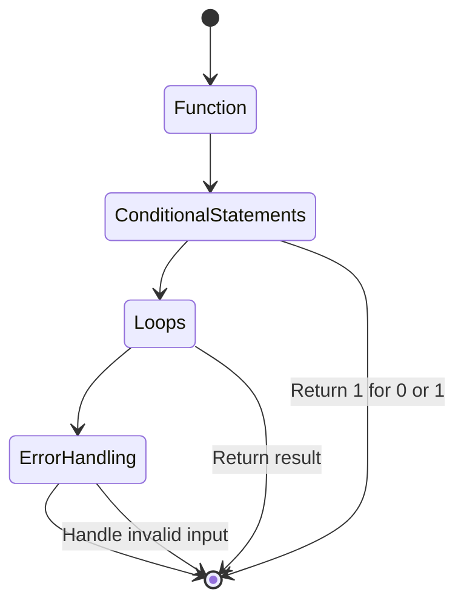

# Detailed Explanation for Solving the Factorial Problem

## Function

1. **Define a function**: Create a function that will receive an integer as its input parameter. This function will perform the computation of the factorial.

## Conditional Statements

2. **Base case**: Implement a conditional statement to handle the base cases. If the input number is 0 or 1, the function should return 1. This is because the factorial of 0 and 1 is defined to be 1.

## Loops

3. **Iterative approach**: For numbers greater than 1, use a loop to calculate the factorial. Initialize a variable to store the intermediate results. The loop should iterate from 2 to the input number, multiplying the result variable by the current iteration value.

## Error Handling

4. **Error handling**: Incorporate error handling to manage incorrect inputs. Ensure that the input is a non-negative integer. If the input is invalid, the function should raise an appropriate error or return an error message.
